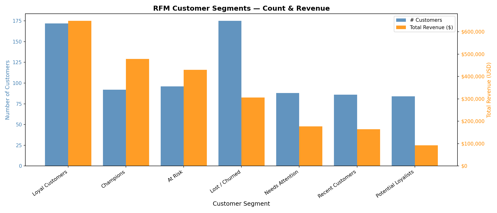

🛒 Customer Segmentation using RFM Analysis
A end-to-end data analysis project that segments 793 customers from 9,994 Superstore transactions using RFM (Recency, Frequency, Monetary) methodology.

📌 Project Summary

Dataset : Superstore Sales (9,994 rows)
Customers Analysed : 793 unique customers 
Tools Used : Python, Pandas, SQL, Matplotlib
Environment : Jupyter Notebook (VS Code)
Segments Identified : 7 customer segments

🎯 Business Problem

A retail business has thousands of customers but treats them all the same way — same emails, same discounts, same campaigns. This wastes budget and loses high-value customers silently.

Goal :Identify who your best customers are, who is slipping away, and who is already gone — so you can act differently for each group.

🔍 What is RFM?

RFM is a proven customer scoring framework:

Recency : How recently did they order?
Frequency : How often do they order?
Monetary : How much do they spend?

Each customer is scored 1–5 on each dimension (5 = best), giving a total RFM score out of 15.

📊 Key Findings

• 96 'At Risk' customers generated $429K but haven't ordered in 7+ months — biggest retention opportunity
• 92 'Champions' have the highest revenue per person — ordered just 26 days ago on average
• 175 customers are 'Lost/Churned' — largest group, lowest spend

🛠 How to Run

git clone https://github.com/dakshshrrma/Customer-Segmentation.git
pip install pandas matplotlib numpy
Then open `customer_segmentation.ipynb` and run all cells in order.

Tools used : VS Code, Project tracked using JIRA

👤 Author

Daksh Sharma
• LinkedIn: [linkedin.com/in/dakshshrrma]
• GitHub: [github.com/dakshshrrma]

